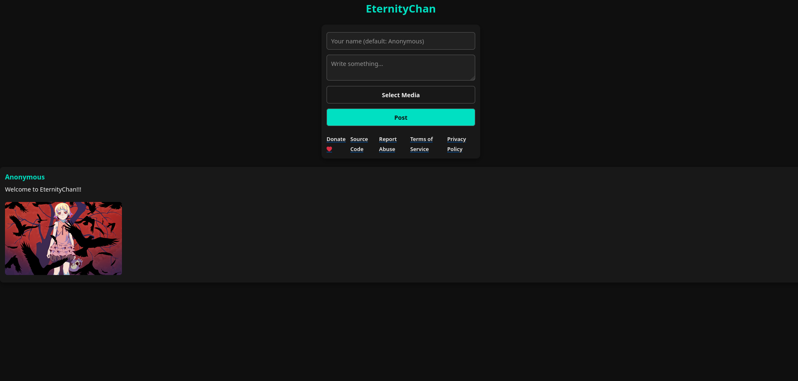

# EternityChan

## An end-to-end encrypted anonymous imageboard
<!-- DESCRIPTION -->
## Description:

An end-to-end encrypted imageboard offers significant benefits in terms of privacy and security for users. With end-to-end encryption, all content, including images, messages, and posts, is encrypted on the sender's side and can only be decrypted by the intended recipient, ensuring that no third parties, including the imageboard administrators or hackers, can access the information.

<!-- FEATURES -->
## Features:

- End-to-end encryption for all user data

- Small codebase

- Server runs even on cheapest hardware

- Docker support

- Built in Rust

## Technical details:

- AES-256-GCM for client-side encryption

- Key is not sent to server

- Server also encrypts data before writing it to disk using ChaCha20-Poly1305 and Argon2id with a password specified by owner

<!-- INSTALLATION -->
## Server setup:

    sudo apt update
    sudo apt install curl build-essential git
    curl https://sh.rustup.rs -sSf | sh -s -- -y
    git clone https://github.com/umutcamliyurt/EternityChan.git
    cd EternityChan/
    cargo build --release
    cargo run --release

## Server setup with Docker:

    git clone https://github.com/umutcamliyurt/EternityChan
    cd EternityChan/
    docker build -t EternityChan .
    docker run -d -p 80:80 --name EternityChan EternityChan

## Requirements:

- [Rust](https://www.rust-lang.org), [Tor](https://gitlab.torproject.org/tpo/core/tor), [Docker](https://www.docker.com/)

<!-- SCREENSHOT -->
## Screenshot:

<!-- LICENSE -->
## License

Distributed under the MIT License. See `LICENSE` for more information.

## Donate to support development of this project!

**Monero(XMR):** 88a68f2oEPdiHiPTmCc3ap5CmXsPc33kXJoWVCZMPTgWFoAhhuicJLufdF1zcbaXhrL3sXaXcyjaTaTtcG1CskB4Jc9yyLV

**Bitcoin(BTC):** bc1qn42pv68l6erl7vsh3ay00z8j0qvg3jrg2fnqv9
